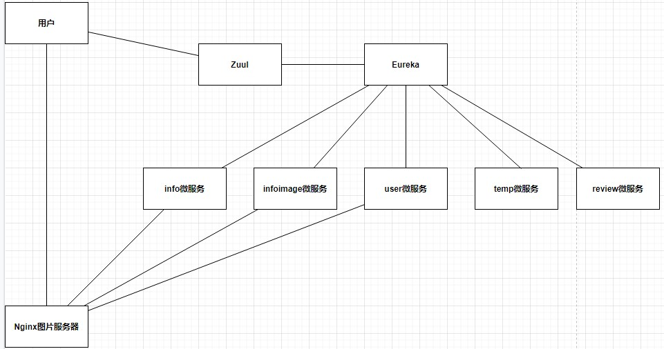

# 此项目已废弃

微服务版本不再更新了, 最新的是单体的版本[点击这里前往](https://github.com/thesomeexp/ParkingProject)

# 众包公益停车(微服务后端)
随着我国经济社会持续快速发展,汽车保有量逐年增加,”停车难”已经成为了困扰人们日常生活的问题.针对这方面的课题,也有很多学者开展了相关的研究.比如: 王先杰等(2019) 以蓝牙模块为基础设计出共享车位的检测系统[3];徐嘉潞等(2019)设计智能车位锁推广应用共享车位[4];黄振宇等(2018)设计互联网+的找寻空闲车位的方式解决城市空闲停车利用率低的问题[5]; 俞建民等(2018)针对基于微信小程序的车位共享平台设计提出了探讨[6];陈霞(2017)提出了众包获取海量车位信息的研究和服务模式框架[7].
  从以上研究成果可以看出,目前国内对于”停车难”问题硬件解决方案的维护成本较高,对于没有成型停车场的一些地区不友好,而且相关的研究仅针对”商圈,学校,医院,居民区”等人口较密集的区域,而忽略了人口密集程度低的路段停车位利用率不高的问题,再者学者们对”众包”探索停车位模式的研究时间均不长.因此,针对社会上依旧还存在停车位信息不对称的”停车难”问题.本项目从提高公共车位利用率,减少停车位和车主间信息不对称的目的出发,提出基于众包和微信小程序的探索停车位的解决方案.

## 说人话
通过该系统用户可以获取公共停车场的一些信息, 比如某时段内停车场的拥挤度情况. 用户可以提交位置偏僻的停车场以提高整体停车位的利用率. 

## 项目需求
用户: 
- 查询附近的已验证的停车场
- 查询停车场详情信息
- 查询自己提交的停车场
- 查询停车场已验证详情图片
- 查询停车场评论
- 添加停车场, 详情图片, 状态, 评论

管理员: 
- 根据状态查询所有停车场, 详情图片
- 更改停车场, 详情图片状态

## 数据库的设计

表的说明: 

info: 
- name 停车场名字
- content 介绍/说明
- logitude 经度
- latitude 纬度
- geoHash 
- uid 用户id
- state 状态
- infoSubmitDate 提交时间
- stateUpdateDate 状态更新时间
- t0\~t23 每个时段的拥挤度状态(0\~10)

infoimage: 
- pid 停车场id
- uid 提交用户id
- submitDate 提交时间
- state 图片状态

temp: 
- uid 用户id
- pid 停车场id
- submitDate 提交时间
- state 用户提交的拥挤度状态
- useful 有帮助投票数量
- bad 无帮助投票数量

user: 
- name 昵称
- password 密码
- salt 盐
- phone 手机号
- role 角色
- score 积分

tempUser: 
- uid 用户id
- tid tempId
- useful 给的评价有无帮助0/1

review: 
- uid 用户id
- pid 停车场id
- submitDate 提交时间
- accuracy 精确度评分
- easyToFind 易找程度评分
- content 评论内容

## 微服务架构图: 

微服务技术栈: JWT, Shiro, Feign

服务器: Docker, Nginx

# 如何运行

本地环境跑的话, 建议vmware虚拟机里nginx服务器使用桥接模式, 这样局域网内就能用手机测试. 首先配置运行eureka, 然后配置运行zuul网关, 数据库中执行parking.sql文件生成数据库, 修改其余每个微服务的数据库连接配置. 之后就可以搭建Nginx图片服务器了, 微服务通过FTP客户端方式上传图片到图片服务器, 所以配置完Nginx图片服务器和FTP客户端后, 修改pojo中FtpUtil.java的FTP客户端配置文件, 具体搭建FTP图片服务器规则可以参考[这里](https://someexp.com/post/serve-image-with-nginx/). 配置好后有两个文件夹需要注意, 一个是image存放的是停车场相关图片, head存放的是头像(定义在user服务中). 之后www下创建head文件夹, 启动user微服务. 然后运行[用户前端](https://gitee.com/fuckkkGitee/ParkingVue-Front), 浏览器打开http://localhost:3000/#/register就进入前端注册页. 注册成功后可以查看数据库插入了一条数据, 然后修改剩余微服务的配置, 再启动剩下的微服务, 整个搭建测试流程就完成了.  注册完就可以运行了. 因为我没有安卓设备, 所以使用chrome的虚拟定位传感器来做测试, 设置在岭师附近的坐标Latitude: 21.269638, Longitude: 110.347652, 然后刷新页面就可以测试接下来的功能了. 

## 注意事项

数据库时区, 请确保数据库时间
~~~
select curtime();
~~~
与当前时间一样, 如果时间有问题请修改时间(仅供参考):
~~~
set global time_zone = '+8:00'; ##修改mysql全局时区为北京时间，即我们所在的东8区
set time_zone = '+8:00'; ##修改当前会话时区
flush privileges; #立即生效
~~~

## 自定义nginx图片服务器配置

本地测试配置参考: https://someexp.com/post/serve-image-with-nginx/

www目录下: 
 
/head 为头像目录

/image 为停车场图片目录

/image/info_detail 为停车场详情图片目录(该目录需要手动创建!!!!!!!!!!)

## 相关: 

项目用户前端(last update): https://github.com/thesomeexp/ParkingVue-Front

项目管理员前端: https://gitee.com/ShawnYcx/ParkingVue
